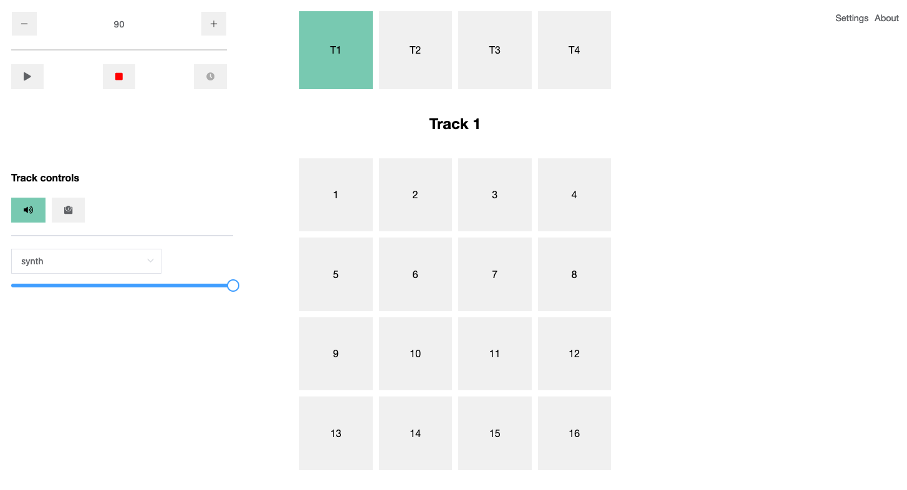

# sequencer

**sequencer** is a groovebox to create own sounds, patterns, and songs.



It includes a sequencer with 1 to 4 tracks which have individual synth and sampler possibilites, effects, and settings.

Each track includes 16 steps which can be controlled specifically one by one.

## Demo

You can play the squencer at the ~~[demo page]()~~.

## Project setup

```
yarn install
```

### Compiles and hot-reloads for development

```
yarn serve
```

### Compiles and minifies for production

```
yarn build
```

## Roadmap

-   [x] Parallel execution of multiple tracks
-   [x] Tracks with individual effects
-   [x] Trigger specific controls
-   [ ] Track length up to 64 steps
-   [ ] Sampling of custom sounds
-   [ ] Track controls like muting
-   [ ] Effect controls over all tracks
-   [ ] Storing and Loading created patterns
-   [ ] Sample Library
-   [ ] Trigger specific sound controls like individual synth or samples
